# PROJECT Design Documentation

> _The following template provides the headings for your Design
> Documentation.  As you edit each section make sure you remove these
> commentary 'blockquotes'; the lines that start with a > character
> and appear in the generated PDF in italics but do so only **after** all team members agree that the requirements for that section and current Sprint have been met. **Do not** delete future Sprint expectations._

## Team Information
* Team name: 1a Codemonkeys
* Team members
  * Quinn Yates
  * Ilia Zhdanov
  * Aidan Sanderson
  * Adam Omelette

## Executive Summary

This is a summary of the project.

### Purpose
Our project is a mutli-paged web application for our UFund campaign **Hungry Hippos**. It allows users to log in, along with an admin role and helper role. The admin can define what **Needs** they require for feeding their hippos, and helpers can fund those **Needs**.

### Glossary and Acronyms
> _**[Sprint 2 & 4]** Provide a table of terms and acronyms._

| Term | Definition |
|------|------------|
| SPA | Single Page |
| DAO | Data Access Object |
| API | Application Programming Interface |
| UI | User Interface |
| OO | Object Oriented |
| Hippo | Hippopotamus |

## Requirements

This section describes the features of the application.

> _In this section you do not need to be exhaustive and list every
> story.  Focus on top-level features from the Vision document and
> maybe Epics and critical Stories._

### Definition of MVP
The MVP for this project is a simple web app where users can log in with just a username (no real security), with “admin” acting as the manager and all other users as helpers. Helpers can browse, search, and fund needs by adding them to a basket and checking out, while the manager can create, edit, and remove needs. All data is saved to files so changes persist between sessions, even after logging out.

### MVP Features
>  _**[Sprint 4]** Provide a list of top-level Epics and/or Stories of the MVP._

### Enhancements
> _**[Sprint 4]** Describe what enhancements you have implemented for the project._

## Application Domain

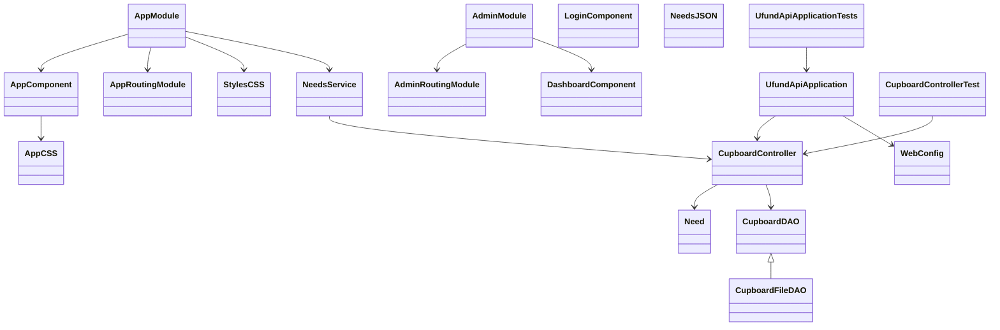

This section describes the application domain.

> Sprint 2 - High level overview of the domain
> In the highest level of our domain heirarchy, we have our backend (ufund-api) and our frontend(ufund-ui/ufund-frontend). In our backend, 
> we have our data directory, containing json files, which store our cupboard and user information for persistence. Along 
> with this, inside src/main we have three layers: controller, model, and persistence. The last thing we have in our backend is our 
> ApiApplication.
> For our frontend, we have the basic angular project structure as well as a service class to interface with our backend conroller, as 
> well as a main app module, which contains our admin/user modules, as well as their respective components. The last thing contained in 
> our app module is a login module which will direct to a user/admin module after login.

## Architecture and Design

This section describes the application architecture.

### Summary

The following Tiers/Layers diagram shows a high-level view of the webapp's architecture. 
**NOTE**: detailed diagrams are required in later sections of this document.
> _**[Sprint 1]** (Augment this diagram with your **own** rendition and representations of sample system classes, placing them into the appropriate Component box (blue rectangle) inside the corresponding Layer. Focus on what is currently required to support **Sprint 1 - Demo requirements**. Make sure to describe your design choices in the corresponding _**Tier Section**_ and also in the _**OO Design Principles**_ section below.)_

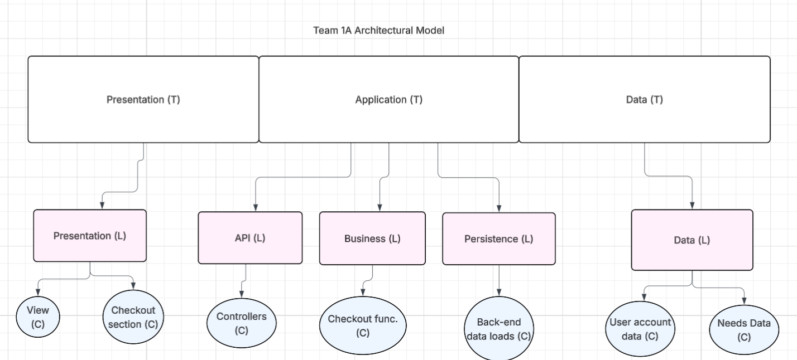

The web application is built using the **Presentation**(frontend), **Application**(backend), **Data** tiered architecture. 

The Presentation (frontend) is a client‑side SPA built with Angular, using HTML, CSS, and TypeScript to deliver the user interface and handle all user interactions.

The Application (backend) tier exposes RESTful APIs, implements business logic, and uses repositories/DAOs to interact with the underlying Data tier for persistence.

The Data contains the mechanisms responsible for storing, retrieving, and managing the application’s data using low‑level storage systems.

Both the Application and Data tiers are implemented using Java and the Spring Framework, with details of their internal components provided below.

### Overview of User Interface

Our User Interface now includes a number of pages, including Home, Login, Helper Cuboard/Checkout, Helper Hippo List, Admin Cupboard, and Admin Hippo List. These routing and "what" the pages are is described below.

The "landing page" for our application is the home page shown below. Users can see hippos live and also log in. The login UI is also displayed below and shows what the users sees after pressing the login button. This page is also always visible to users when logged in by navigating with the "Home" button.

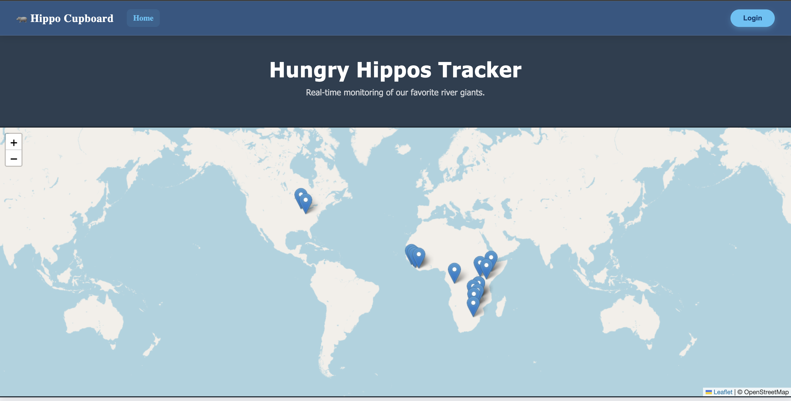
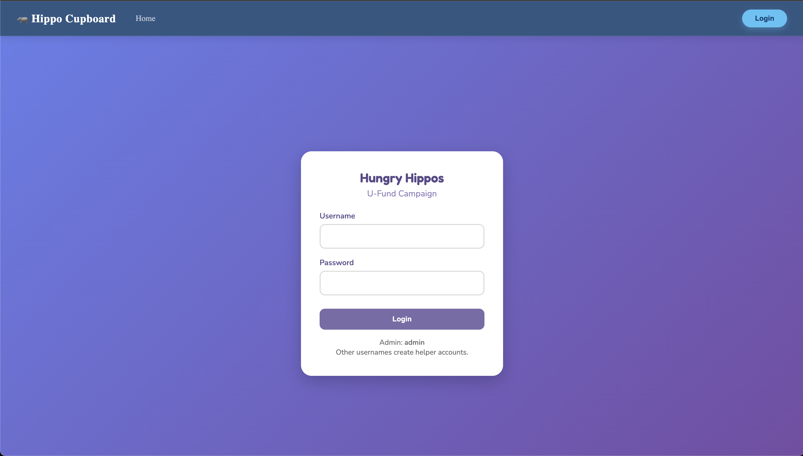
These are our two admin pages. Admins can define needs with the first UI below. Our second page for admins is the Hippos page, which allows them to add/remove hippos that need to be funded.
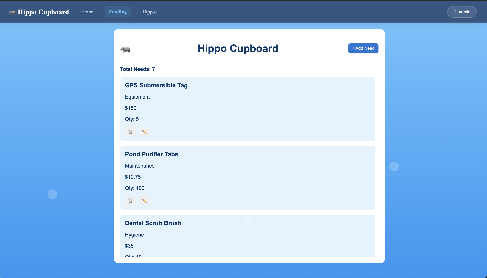
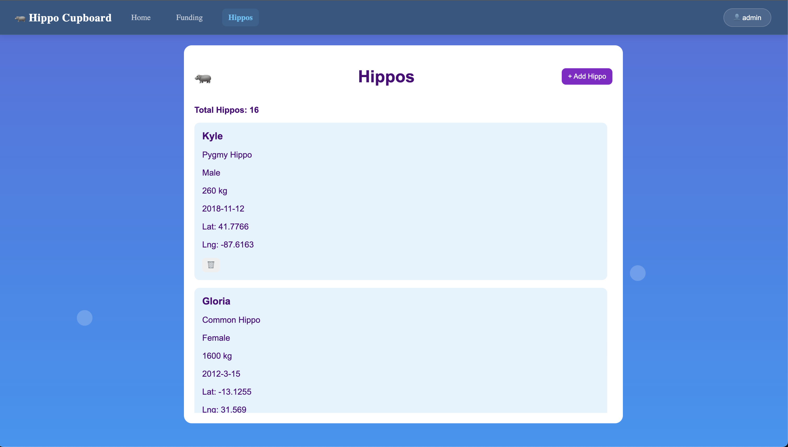

These are our two helper pages. With the first one, helpers can buy needs either generally, or for a selected hippo. These can be selected through the Hippo page, and when navigating back to the Funding page after selecting a hippo, there is a display on the screen showing which hippo you are funding while adding/purchasing needs.

The second page, the hippo list for helpers, displays a list of all active hippos and has a button for users to select a hippo. After doing this there is a popup saying which hippo was just selected.
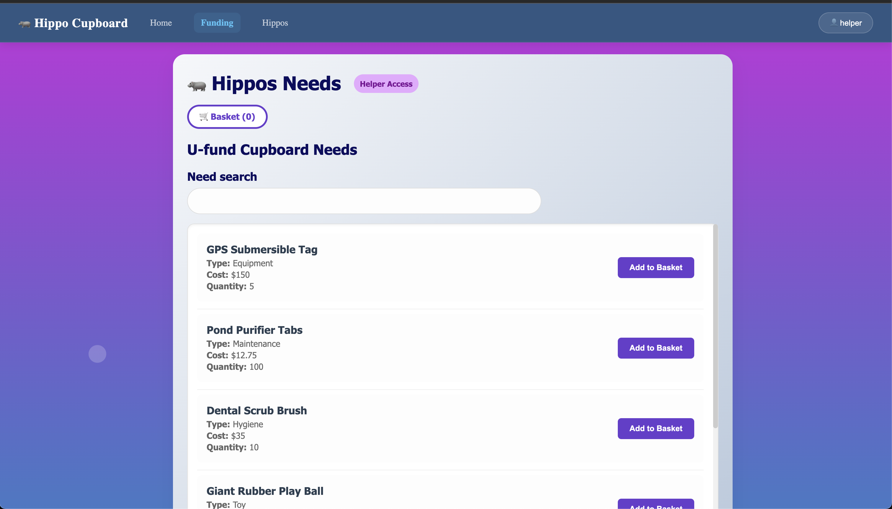
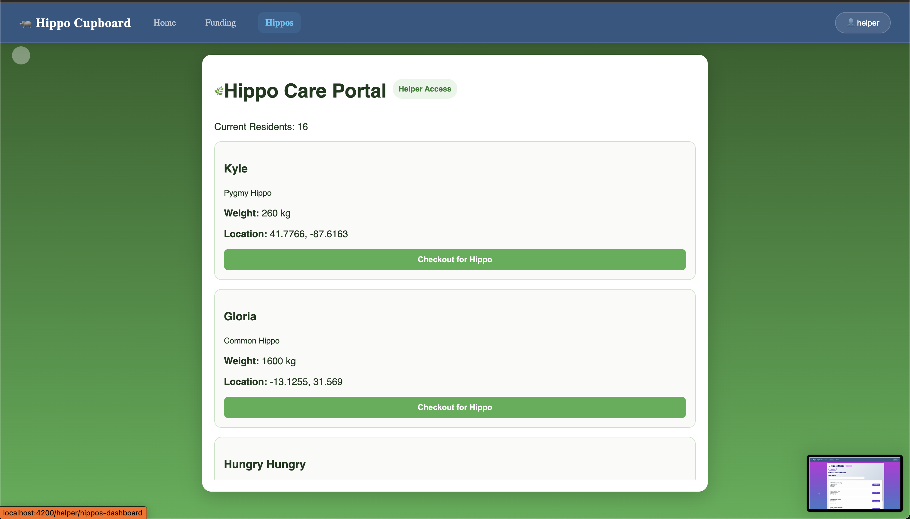

### Presentation Tier
> _**[Sprint 4]** Provide a summary of the Presentation Tier UI of your architecture.
> Describe the types of components in the tier and describe their
> responsibilities.  This should be a narrative description, i.e. it has
> a flow or "story line" that the reader can follow._

> _**[Sprint 4]** You must  provide at least **2 sequence diagrams** as is relevant to a particular aspects 
> of the design that you are describing.  (**For example**, in a shopping experience application you might create a 
> sequence diagram of a customer searching for an item and adding to their cart.)
> As these can span multiple tiers, be sure to include the round-trip, starting at an HTTP request from the client-side (frontend), covering steps through the server-side (backend) and reaching data storage
> to help illustrate the end-to-end flow._

> _**[Sprint 4]** To effectively illustrate the system, you should include static **class diagrams**  where they are relevant to your design. Some additional guidance is provided below:_
 >* _Class diagrams apply to the **Application** tier and more specifically within its relevant **Layers**._
>* _A single class diagram of the entire system will not be effective. You may start with one, but will need to break it down into smaller sections to account for requirements of each of the Layer's static models below._
 >* _Correct labeling of relationships with proper notation for the relationship type, multiplicities, and navigation information will be important._
 >* _Include other details such as attributes and method signatures that you think are needed to support the level of detail in your discussion._

### Application Tier
> _**[Sprint 4]** Provide a summary of this tier of your architecture. This
> section will follow the same instructions that are given for the Presentation
> Tier above._
> 
#### API Layer
**[Sprint 1, 4]** Provide a summary of this architectural layer.
> Sprint 1: The API layer is simple, consisting of a controller class which allows access to our initial cupboard. It allows us to add/remove/edit/access needs stored in the cupboard as a developer.

**CupboardController.Java**
> This class represents the access to our cupboard Data Access Object and implements behaviors the admin can access via HTTP requests.

**BasketController.Java**
> This class represents the access to our funding basket Data Access Object and implements the behaviors a user can use to view/edit/remove Needs
> to/from their funding basket.

**UserController.Java**
> This class represents access to our user Data Access Object and implements methdods for accessing user data. This is primarily used by the system
> for user authorization and data persistence.

> _At appropriate places as part of this narrative provide **one** or more updated and **properly labeled**
> static models (UML class diagrams) with some details such as associations (connections) between classes, and critical attributes and methods. (**Be sure** to revisit the Static **UML Review Sheet** to ensure your class diagrams are using correct format and syntax.)_

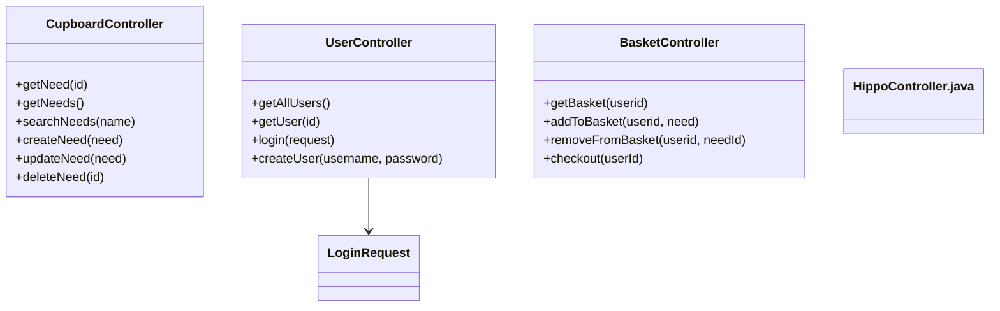

#### Business Layer
**[Sprint 1, 4]** Provide a summary of this architectural layer.
> Sprint 2: Since the business logic required for our current project is relatively simple, our business layer is not entirely seperated from our API layer. Most of our very simple business logic is simply contained inside the controller functions and classes defined above.
> [Link to related classes](#api-layer)

> _At appropriate places as part of this narrative provide **one** or more updated and **properly labeled**
> static models (UML class diagrams) with some details such as associations (connections) between classes, and critical attributes and methods. (**Be sure** to revisit the Static **UML Review Sheet** to ensure your class diagrams are using correct format and syntax.)_

#### Persistence Layer
**[Sprint 1, 4]** Provide a summary of this architectural layer.
> Our persistence layer naturally relates closely to the API and Business layer, but implements data access to our json files used for storage and persistence.

**BasketFileDAO** 
> This class implements the actions defined in BasketDAO and accesses the basket.json file storing all funding basket information. It implements actions such as add/remove/get a need from each given basket.

**CupboardFileDAO**
> This class implements the actions defined in CupboardDAO and accesses the needs.json file storing all needs contained in the cupboard. It also implements actions relating to the cupboard such as search/get/add/remove/edit a need in the file.

**UserFileDAO**
> This class implements the actions defined in UserDAO and accesses the users.json file storing all user information. It allows for adding/removing/verifying user information.

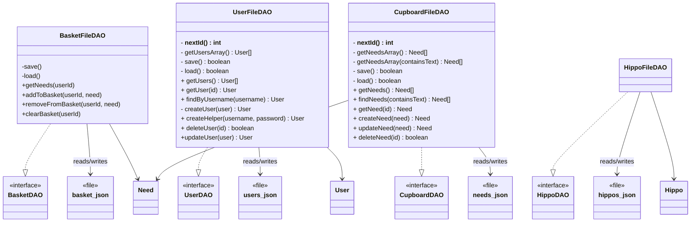

### Data Tier
> _**[Sprint 1, 4]** Provide a summary of this tier of your architecture. This
> section will follow the same instructions that are given for the Presentation
> Tier above._
> 
## OO Design Principles

In our design, we focused on a few key Object-Oriented principles to keep the system clean and easy to maintain.

We applied Encapsulation by keeping data and behavior within the same classes. For example, Need and User store their own data, while classes like CupboardFileDAO and UserFileDAO handle all file interactions internally, preventing other parts of the system from directly accessing JSON files.

We also used Abstraction through interfaces like CupboardDAO, UserDAO, and BasketDAO. These define what actions can be performed without exposing how they are implemented, allowing controllers such as CupboardController to work with data without worrying about storage details.

Finally, we followed the Single Responsibility Principle (SRP) by giving each class one clear role. Controllers handle requests, DAO classes manage data, and models represent the data itself, making the system easier to understand and modify.

> _**[Sprint 3 & 4]** OO Design Principles should span across **all tiers.**_

## Static Code Analysis/Future Design Improvements

Our backend recieved a score of C for reliability and A for maintainability. It has one issue in reliability , and 146 for maintainability as shown below. The frontend has a C for reliability and an A for maintainability, with 3 issues.

> 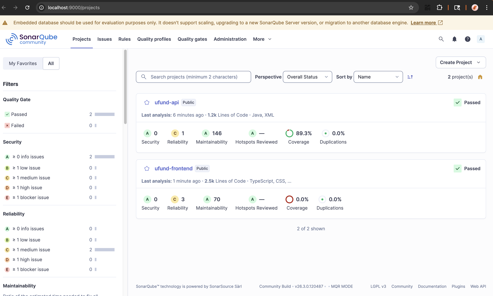

The one issue in the backend has to do with setting the correct Http Status, as shown below.

> 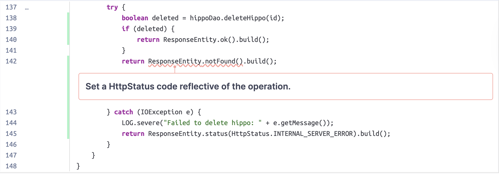

The issue here is that if the user tries to delete something that was already deleted, it currently returns a 404. It should actually just return ok (204) 
regardless of wether it has already been deleted or not. This allows for a cleaner user experience and removed unnecessary error handling.

The second issue is an improper function call to `fetchHippos()` in the frontend.

> 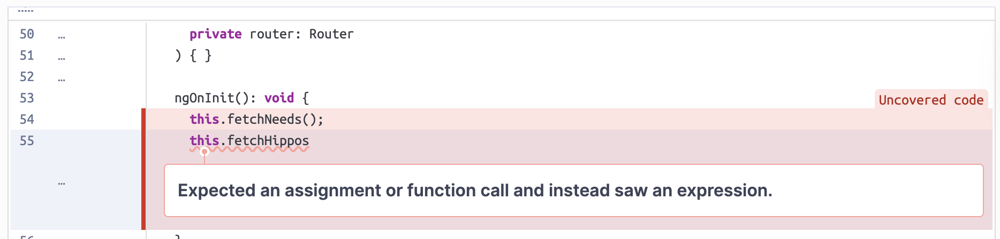

The function being called without parenthesis will cause ths function to not be called in the ngOnInit, meaning a new list of hippos will not be displayed when the page is opened. This can be fixed easily by adding parenthesis to at the end of the function call.

The third issue is an improper association between a form label and its control in the frontend template.

> 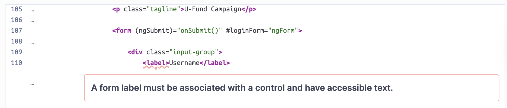

The `<label>` element is missing a connection to its corresponding input field, which triggers accessibility warnings. Without this link, screen readers cannot identify which field the label describes, and users cannot click the label text to focus the input. This can be fixed by adding a `for` attribute to the label that matches the `id` of the input field.

> If our team had additional time, we would spend a large portion going through this static code analysis and making small fixes to improve the reliability and maintainability of our code. Along with this, we would do more testing of the UI to ensure our product is "release ready".

## Testing
> _This section will provide information about the testing performed
> and the results of the testing._

### Acceptance Testing
> Sprint 2: We have passed all 34 acceptance criteria for sprint 2. Each acceptance criteria has been tested thouroughly by the person who implemented it, as well as a seperate team member to ensure that all critera were met.

> Sprint 3: We have now passed all of our acceptacnce criteria for sprint 3 aswell. Each criteria has been tested by every member of the team to ensure no small bugs were missed.

### Unit Testing and Code Coverage
> _**[Sprint 4]** Discuss your unit testing strategy. Report on the code coverage
> achieved from unit testing of the code base. Discuss the team's
> coverage targets, why you selected those values, and how well your
> code coverage met your targets._

> **[Sprint 3]** As of sprint 3, we have added an extra model for our Hippo data, and implemented testing for this. Our overall test coverage is still above 90% after these changes.

> 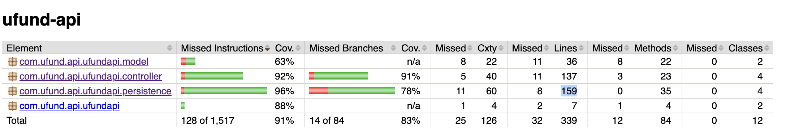
> 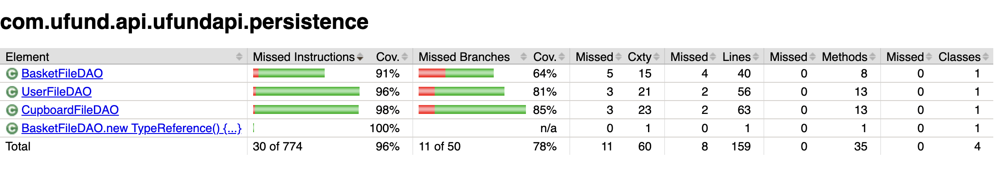
> 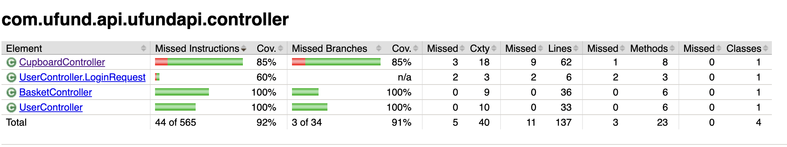

## Ongoing Rationale
Sprint 2:
> Add more hippos - March 18th
>_**[Sprint 1, 2, 3 & 4]** Throughout the project, provide a time stamp **(yyyy/mm/dd): Sprint # and description** of any _**mayor**_ team decisions or design milestones/changes and corresponding justification._