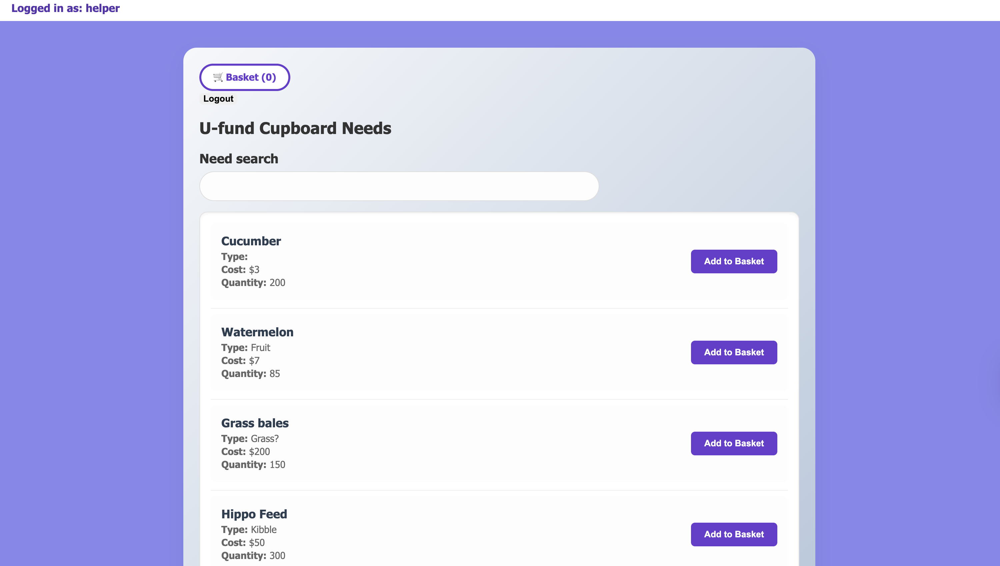
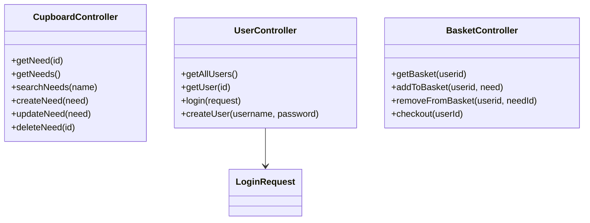
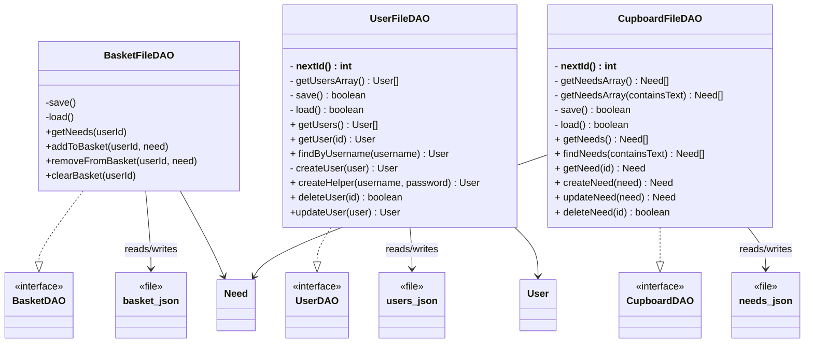

# PROJECT Design Documentation

> _The following template provides the headings for your Design
> Documentation.  As you edit each section make sure you remove these
> commentary 'blockquotes'; the lines that start with a > character
> and appear in the generated PDF in italics but do so only **after** all team members agree that the requirements for that section and current Sprint have been met. **Do not** delete future Sprint expectations._

## Team Information
* Team name: 1a Codemonkeys
* Team members
  * Quinn Yates
  * Ilia Zhdanov
  * Aidan Sanderson
  * MEMBER4

## Executive Summary

This is a summary of the project.

### Purpose
>  _**[Sprint 2 & 4]** Provide a very brief statement about the project and the most
> important user group and user goals._

### Glossary and Acronyms
> _**[Sprint 2 & 4]** Provide a table of terms and acronyms._

| Term | Definition |
|------|------------|
| SPA | Single Page |

## Requirements

This section describes the features of the application.

> _In this section you do not need to be exhaustive and list every
> story.  Focus on top-level features from the Vision document and
> maybe Epics and critical Stories._

### Definition of MVP
> _**[Sprint 2 & 4]** Provide a simple description of the Minimum Viable Product._

### MVP Features
>  _**[Sprint 4]** Provide a list of top-level Epics and/or Stories of the MVP._

### Enhancements
> _**[Sprint 4]** Describe what enhancements you have implemented for the project._

## Application Domain

This section describes the application domain.

> Sprint 2 - High level overview of the domain
> In the highest level of our domain heirarchy, we have our backend (ufund-api) and our frontend(ufund-ui/ufund-frontend). In our backend, 
> we have our data directory, containing json files, which store our cupboard and user information for persistence. Along 
> with this, inside src/main we have three layers: controller, model, and persistence. The last thing we have in our backend is our 
> ApiApplication.
> For our frontend, we have the basic angular project structure as well as a service class to interface with our backend conroller, as 
> well as a main app module, which contains our admin/user modules, as well as their respective components. The last thing contained in 
> our app module is a login module which will direct to a user/admin module after login.

## Architecture and Design

This section describes the application architecture.

### Summary

The following Tiers/Layers diagram shows a high-level view of the webapp's architecture. 
**NOTE**: detailed diagrams are required in later sections of this document.
> _**[Sprint 1]** (Augment this diagram with your **own** rendition and representations of sample system classes, placing them into the appropriate Component box (blue rectangle) inside the corresponding Layer. Focus on what is currently required to support **Sprint 1 - Demo requirements**. Make sure to describe your design choices in the corresponding _**Tier Section**_ and also in the _**OO Design Principles**_ section below.)_

The web application is built using the **Presentation**(frontend), **Application**(backend), **Data** tiered architecture. 

The Presentation (frontend) is a client‑side SPA built with Angular, using HTML, CSS, and TypeScript to deliver the user interface and handle all user interactions.

The Application (backend) tier exposes RESTful APIs, implements business logic, and uses repositories/DAOs to interact with the underlying Data tier for persistence.

The Data contains the mechanisms responsible for storing, retrieving, and managing the application’s data using low‑level storage systems.

Both the Application and Data tiers are implemented using Java and the Spring Framework, with details of their internal components provided below.

### Overview of User Interface

Our User Interface is relatively simple, and only consists of three different "pages". We first have our landing page which is our login page, and is relatively simple visually with only a box in the middle containing fields for entering username, password, and a login button. This page then is able to navigate to our helper page(shown below) and our admin page. These two are going to be quite similar, with the exception of admin not having a funding basket or checkout. The layout of the helper page shown below is going to be similar to our design theme for sprint 3. Both of these pages can route back to the login page using the logout button at the top.

### 
Above is our most complicated and most likely more traveled page, the user's "dashboard". It consists of many UI elements such as displaying current user and a logout button near the top. Along with this, much of the functionality lies in the needs list and funding basket. Both of these are made to be simple and clear, while also being a significant focus of the UI. One thing this layout screenshot does not show is the funding basket, which is collapsible to minimize clutter. The last feature of this layout is the search bar, which will dynamically refresh the list of needs when a user wants to search for a specific need.
>  (Add low-fidelity mockups prior to initiating your **[Sprint 2]**  work so you have a good idea of the user interactions.) Eventually replace with representative screenshots of your high-fidelity results as these become available and finally include future recommendations improvement recommendations for your **[Sprint 4]** )_

### Presentation Tier
> _**[Sprint 4]** Provide a summary of the Presentation Tier UI of your architecture.
> Describe the types of components in the tier and describe their
> responsibilities.  This should be a narrative description, i.e. it has
> a flow or "story line" that the reader can follow._

> _**[Sprint 4]** You must  provide at least **2 sequence diagrams** as is relevant to a particular aspects 
> of the design that you are describing.  (**For example**, in a shopping experience application you might create a 
> sequence diagram of a customer searching for an item and adding to their cart.)
> As these can span multiple tiers, be sure to include the round-trip, starting at an HTTP request from the client-side (frontend), covering steps through the server-side (backend) and reaching data storage
> to help illustrate the end-to-end flow._

> _**[Sprint 4]** To effectively illustrate the system, you should include static **class diagrams**  where they are relevant to your design. Some additional guidance is provided below:_
 >* _Class diagrams apply to the **Application** tier and more specifically within its relevant **Layers**._
>* _A single class diagram of the entire system will not be effective. You may start with one, but will need to break it down into smaller sections to account for requirements of each of the Layer's static models below._
 >* _Correct labeling of relationships with proper notation for the relationship type, multiplicities, and navigation information will be important._
 >* _Include other details such as attributes and method signatures that you think are needed to support the level of detail in your discussion._

### Application Tier
> _**[Sprint 4]** Provide a summary of this tier of your architecture. This
> section will follow the same instructions that are given for the Presentation
> Tier above._
> 
#### API Layer
**[Sprint 1, 4]** Provide a summary of this architectural layer.
> Sprint 1: The API layer is simple, consisting of a controller class which allows access to our initial cupboard. It allows us to add/remove/edit/access needs stored in the cupboard as a developer.

**[Sprint 1, 2, 3]** List the classes supporting this layer and provide a brief description of their purpose.

**CupboardController.Java**
> This class represents the access to our cupboard Data Access Object and implements behaviors the admin can access via HTTP requests.

**BasketController.Java**
> This class represents the access to our funding basket Data Access Object and implements the behaviors a user can use to view/edit/remove Needs
> to/from their funding basket.

**UserController.Java**
> This class represents access to our user Data Access Object and implements methdods for accessing user data. This is primarily used by the system
> for user authorization and data persistence.

> _At appropriate places as part of this narrative provide **one** or more updated and **properly labeled**
> static models (UML class diagrams) with some details such as associations (connections) between classes, and critical attributes and methods. (**Be sure** to revisit the Static **UML Review Sheet** to ensure your class diagrams are using correct format and syntax.)_

#### Business Layer
**[Sprint 1, 4]** Provide a summary of this architectural layer.
> Sprint 2: Since the business logic required for our current project is relatively simple, our business layer is not entirely seperated from our API layer. Most of our very simple business logic is simply contained inside the controller functions and classes defined above.
> [Link to related classes](#api-layer)

> _At appropriate places as part of this narrative provide **one** or more updated and **properly labeled**
> static models (UML class diagrams) with some details such as associations (connections) between classes, and critical attributes and methods. (**Be sure** to revisit the Static **UML Review Sheet** to ensure your class diagrams are using correct format and syntax.)_

#### Persistence Layer
**[Sprint 1, 4]** Provide a summary of this architectural layer.
> Our persistence layer naturally relates closely to the API and Business layer, but implements data access to our json files used for storage and persistence.

**[Sprint 1, 2, 3]** List the classes supporting this layer and provide a brief description of their purpose.

**BasketFileDAO** 
> This class implements the actions defined in BasketDAO and accesses the basket.json file storing all funding basket information. It implements actions such as add/remove/get a need from each given basket.

**CupboardFileDAO**
> This class implements the actions defined in CupboardDAO and accesses the needs.json file storing all needs contained in the cupboard. It also implements actions relating to the cupboard such as search/get/add/remove/edit a need in the file.

**UserFileDAO**
> This class implements the actions defined in UserDAO and accesses the users.json file storing all user information. It allows for adding/removing/verifying user information.

### Data Tier
> _**[Sprint 1, 4]** Provide a summary of this tier of your architecture. This
> section will follow the same instructions that are given for the Presentation
> Tier above._
> 
## OO Design Principles

> _**[Sprint 1]** Name and describe the initial OO Principles that your team has considered in support of your design (and implementation) for this first Sprint._

> _**[Sprint 2, 3 & 4]** Will eventually address up to **4 key OO Principles** in your final design. Follow guidance in augmenting those completed in previous Sprints as indicated to you by instructor. Be sure to include any diagrams (or clearly refer to ones elsewhere in your Tier sections above) to support your claims._

> _**[Sprint 3 & 4]** OO Design Principles should span across **all tiers.**_

## Static Code Analysis/Future Design Improvements
> _**[Sprint 4]** With the results from the Static Code Analysis exercise, 
> **Identify 3-4** areas within your code that have been flagged by the Static Code 
> Analysis Tool (SonarQube) and provide your analysis and recommendations.  
> Include any relevant screenshot(s) with each area._

> _**[Sprint 4]** Discuss **future** refactoring and other design improvements your team would explore if the team had additional time._

## Testing
> _This section will provide information about the testing performed
> and the results of the testing._

### Acceptance Testing
> _**[Sprint 2 & 4]** Report on the number of user stories that have passed all their
> acceptance criteria tests, the number that have some acceptance
> criteria tests failing, and the number of user stories that
> have not had any testing yet. Highlight the issues found during
> acceptance testing and if there are any concerns._

### Unit Testing and Code Coverage
> _**[Sprint 4]** Discuss your unit testing strategy. Report on the code coverage
> achieved from unit testing of the code base. Discuss the team's
> coverage targets, why you selected those values, and how well your
> code coverage met your targets._

>_**[Sprint 2, 3 & 4]** **Include images of your code coverage report.** If there are any anomalies, discuss
> those._

## Ongoing Rationale
>_**[Sprint 1, 2, 3 & 4]** Throughout the project, provide a time stamp **(yyyy/mm/dd): Sprint # and description** of any _**mayor**_ team decisions or design milestones/changes and corresponding justification._
