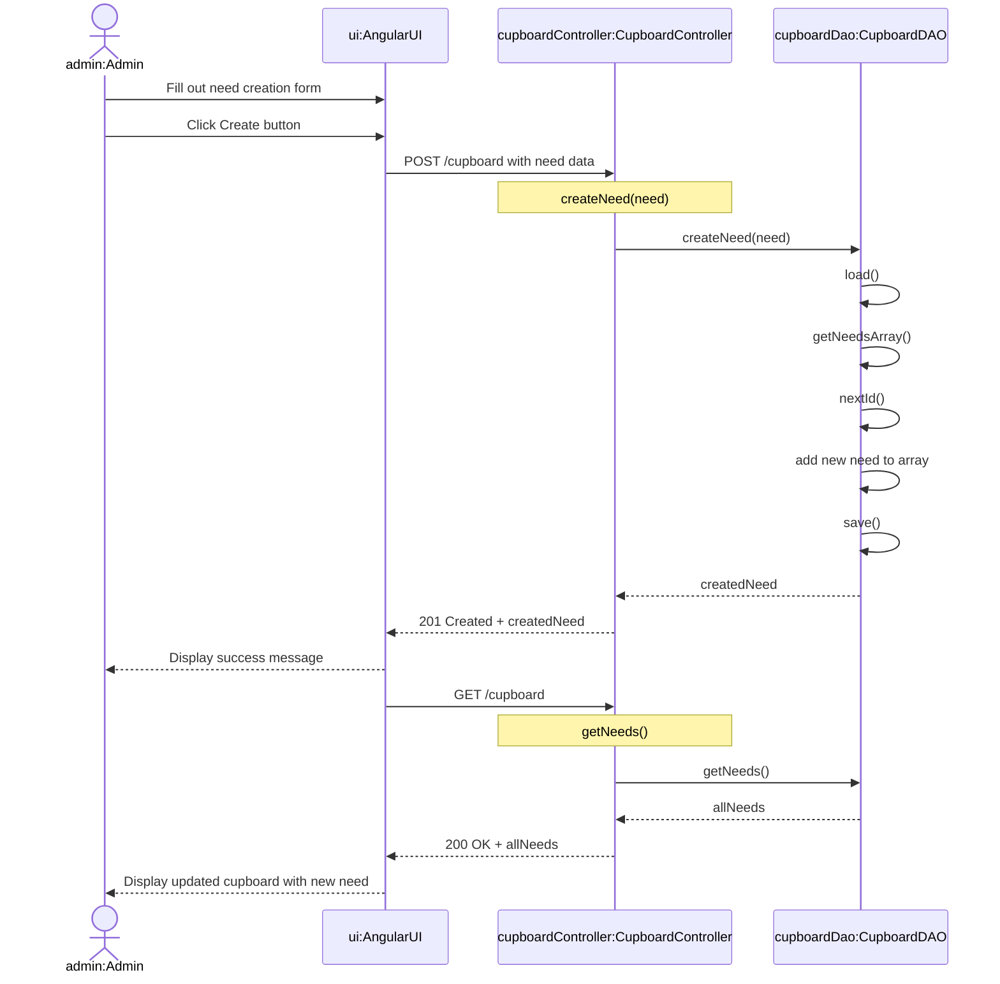
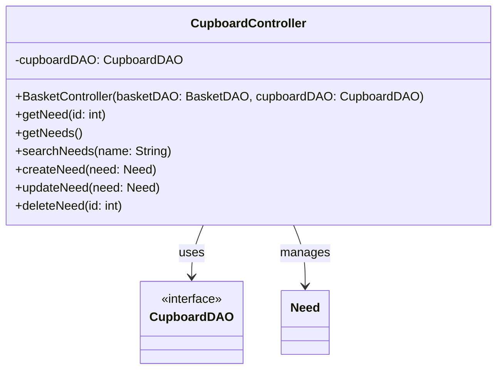
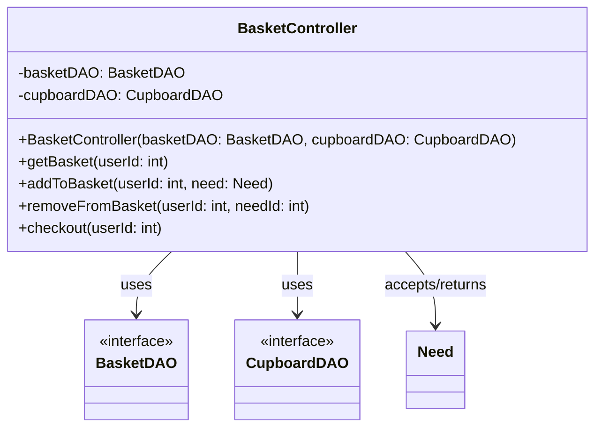
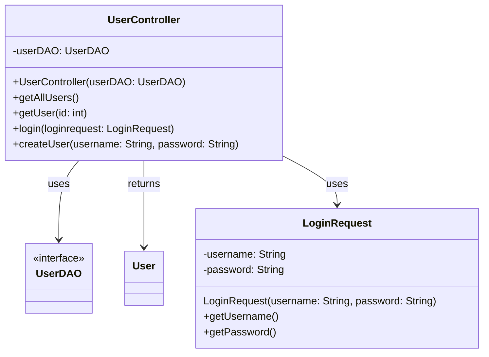
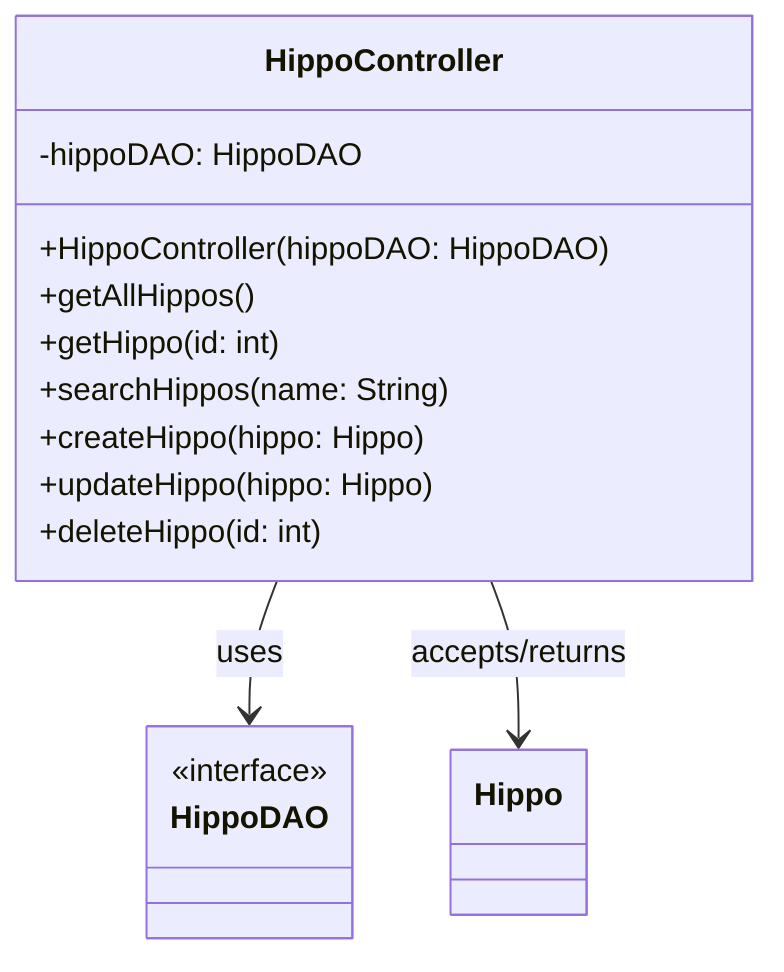
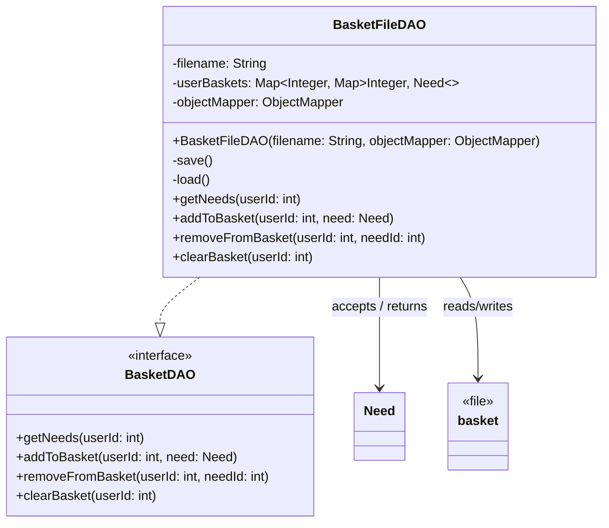
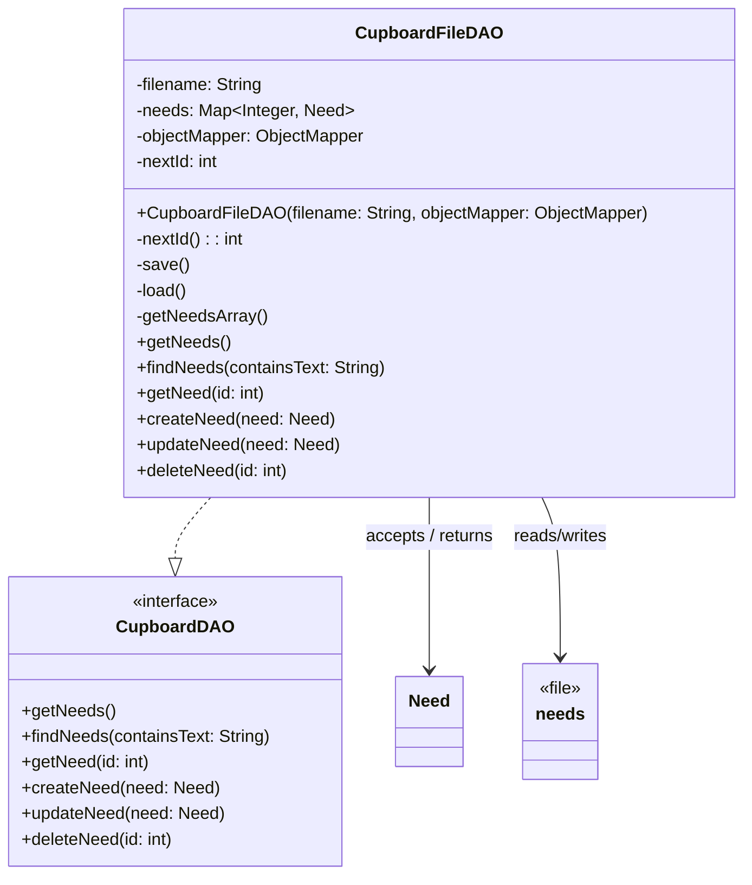
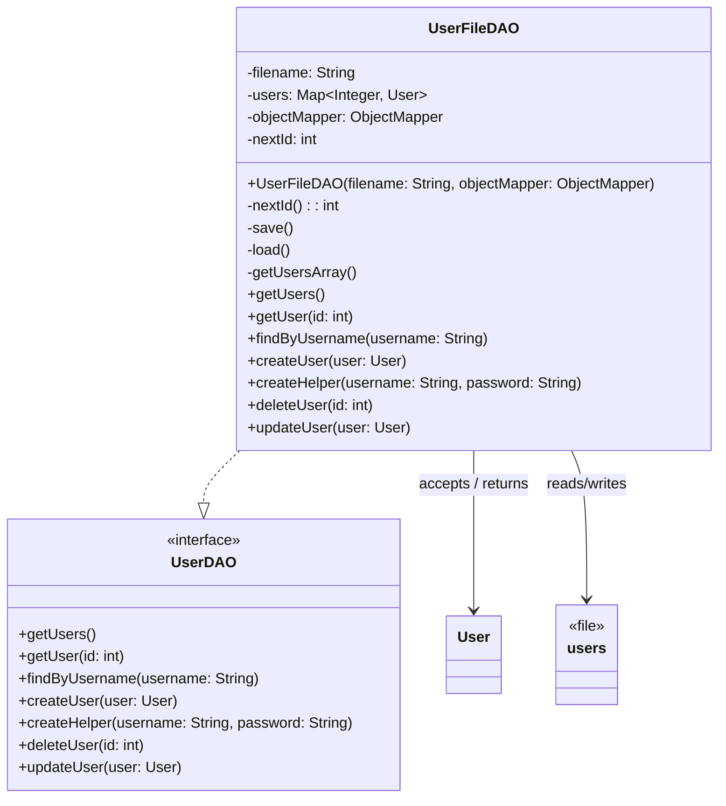
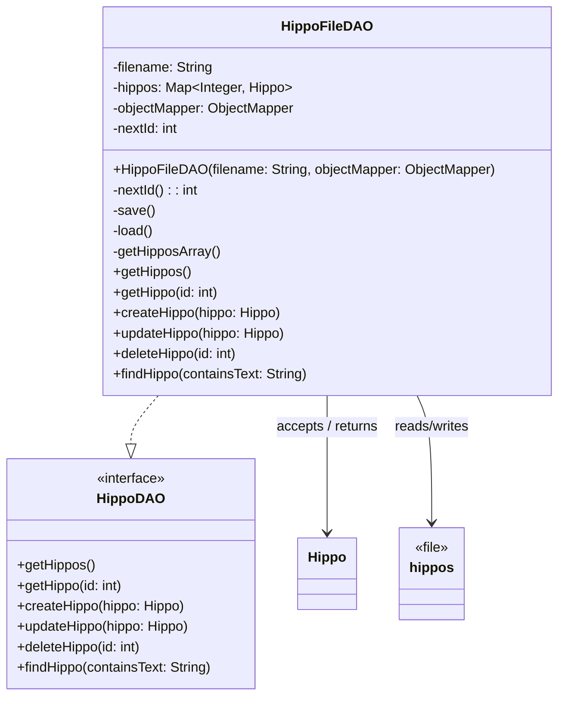

# PROJECT Design Documentation


## Team Information
* Team name: 1a Codemonkeys
* Team members
  * Quinn Yates
  * Ilia Zhdanov
  * Aidan Sanderson
  * Adam Omelette

## Executive Summary

This is a summary of the project.

### Purpose
Our project is a mutli-paged web application for our UFund campaign **Hungry Hippos**. It allows users to log in, along with an admin role and helper role. The admin can define what **Needs** they require for feeding their hippos, and helpers can fund those **Needs**.

### Glossary and Acronyms

| Term | Definition |
|------|------------|
| SPA | Single Page |
| DAO | Data Access Object |
| API | Application Programming Interface |
| UI | User Interface |
| OO | Object Oriented |
| Hippo | Hippopotamus |


## Requirements

This section describes the features of the application.

### Definition of MVP
The MVP for this project is a simple web app where users can log in with just a username (no real security), with “admin” acting as the manager and all other users as helpers. Helpers can browse, search, and fund needs by adding them to a basket and checking out, while the manager can create, edit, and remove needs. All data is saved to files so changes persist between sessions, even after logging out.

### MVP Features

**Epic 1: User Login and Role Access**  

Users can log in to the application and are directed to the correct interface based on whether they are an admin or a helper.

**Epic 2: View and Search Needs**  

Helpers can view the list of available needs in the cupboard and search for specific needs.

**Epic 3: Manage Funding Basket**  

Helpers can add needs to a funding basket, remove needs from the basket, and review the basket before checkout.

**Epic 4: Fund Needs Through Checkout**  

Helpers can check out their basket to fund selected needs.

**Epic 5: Manage Needs**  

The admin can create, update, and delete needs in the cupboard.

**Epic 6: Persistent Data Storage**  

The system stores users, needs, baskets, and hippo information in files so that data is preserved between sessions.

**Epic 7: Manage and View Hippos**

The admin can create, update, and remove hippos, while helpers can view the list of hippos and choose which hippo they want to fund.

### Enhancements
> _**[Sprint 4]** Describe what enhancements you have implemented for the project._
As 

## U-Fund Domain Model

```mermaid
flowchart LR
    Helper[Helper]
    Admin[Admin]
    Need[Need]
    Cupboard[Cupboard]
    Basket[Funding Basket]
    Checkout[Checkout]
    Hippo[Hippo]
    Backlog[Data Backlog]

    Helper -->|views and selects| Need
    Need -->|stored in| Cupboard
    Helper -->|adds needs to| Basket
    Basket -->|contains| Need
    Helper -->|checks out through| Checkout
    Checkout -->|funds| Need

    Admin -->|creates / updates / removes| Need
    Admin -->|manages| Cupboard
    Admin -->|views| Backlog

    Hippo -->|has| Need
    Helper -->|chooses| Hippo

    Basket -->|tracks selected needs| Backlog
    Checkout -->|updates funded needs in| Backlog
    Cupboard -->|updates availability in| Backlog
  ```


This section describes the application domain.

> Sprint 2 - High level overview of the domain
> In the highest level of our domain heirarchy, we have our backend (ufund-api) and our frontend(ufund-ui/ufund-frontend). In our backend, 
> we have our data directory, containing json files, which store our cupboard and user information for persistence. Along 
> with this, inside src/main we have three layers: controller, model, and persistence. The last thing we have in our backend is our 
> ApiApplication.
> For our frontend, we have the basic angular project structure as well as a service class to interface with our backend conroller, as 
> well as a main app module, which contains our admin/user modules, as well as their respective components. The last thing contained in 
> our app module is a login module which will direct to a user/admin module after login.


## Architecture and Design

This section describes the application architecture.

### Summary

The following Tiers/Layers diagram shows a high-level view of the webapp's architecture. 
**NOTE**: detailed diagrams are required in later sections of this document.
> _**[Sprint 1]** (Augment this diagram with your **own** rendition and representations of sample system classes, placing them into the appropriate Component box (blue rectangle) inside the corresponding Layer. Focus on what is currently required to support **Sprint 1 - Demo requirements**. Make sure to describe your design choices in the corresponding _**Tier Section**_ and also in the _**OO Design Principles**_ section below.)_


The web application is built using the **Presentation**(frontend), **Application**(backend), **Data** tiered architecture. 

The Presentation (frontend) is a client‑side SPA built with Angular, using HTML, CSS, and TypeScript to deliver the user interface and handle all user interactions.

The Application (backend) tier exposes RESTful APIs, implements business logic, and uses repositories/DAOs to interact with the underlying Data tier for persistence.

The Data contains the mechanisms responsible for storing, retrieving, and managing the application’s data using low‑level storage systems.

Both the Application and Data tiers are implemented using Java and the Spring Framework, with details of their internal components provided below.


### Overview of User Interface

Our User Interface now includes a number of pages, including Home, Login, Helper Cuboard/Checkout, Helper Hippo List, Admin Cupboard, and Admin Hippo List. These routing and "what" the pages are is described below.

The "landing page" for our application is the home page shown below. Users can see hippos live and also log in. The login UI is also displayed below and shows what the users sees after pressing the login button. This page is also always visible to users when logged in by navigating with the "Home" button.


These are our two admin pages. Admins can define needs with the first UI below. Our second page for admins is the Hippos page, which allows them to add/remove hippos that need to be funded.


These are our two helper pages. With the first one, helpers can buy needs either generally, or for a selected hippo. These can be selected through the Hippo page, and when navigating back to the Funding page after selecting a hippo, there is a display on the screen showing which hippo you are funding while adding/purchasing needs.

The second page, the hippo list for helpers, displays a list of all active hippos and has a button for users to select a hippo. After doing this there is a popup saying which hippo was just selected.


### Presentation Tier
In out ptoject the Presentation Tier in this project is the frontend part of the system and is implemented using Angular. It is responsible for displaying the user interface and allowing users to interact with the main features of the application. This tier includes modules, components, routing, and service classes that work together to display information and send user requests to the backend. The main components in this tier support both helper and admin interactions. For example, the login component allows users to sign in and directs them to the correct interface based on their role. The helper dashboard allows users to view available needs, search for items in the cupboard, view the list of hippos, choose a hippo for checkout, manage their funding basket, and complete checkout. The admin dashboard allows admins to create, update, and remove needs and manage hippos. Service classes in the Presentation Tier are responsible for communicating with the backend API. When a user performs an action in the interface, such as searching for a need or adding an item to the funding basket, the appropriate Angular service sends an HTTP request to the backend and returns the response to the component so the interface can be updated. Overall, the Presentation Tier provides the visible interface of the system and is the place where user actions begin.

## Sequence Diagram: Customer searches for a need and adds it to the funding basket

### Description
This sequence diagram shows a customer searching for a need in the Angular frontend and then adding a selected need to the funding basket.

### Sequence Diagram
```mermaid
sequenceDiagram
    actor customer as customer:Customer
    participant ui as ui:AngularUI
    participant needController as needController:NeedController
    participant needDao as needDao:NeedDAO
    participant basketController as basketController:BasketController
    participant basketDao as basketDao:BasketDAO

    customer->>ui: Enter search keyword
    ui->>needController: GET /needs?name=name
    note over needController: searchNeeds(name)
    needController->>needDao: findNeeds(conatainsText)
    needDao-->>needController: matchingNeeds
    needController-->>ui: 200 OK + matchingNeeds
    ui-->>customer: Display matching needs


    customer->>ui: Select need and click "Add to Basket"
    ui->>basketController: POST /basket/{userId}
    note over basketController: addToBasket(userId, needId)
    basketController->>basketDao: addToBasket(userId, needId)

    alt current basket exists
        basketDao->>basketDao: get current basket
    else current basket is null
        basketDao->>basketDao: create new basket map
    end

    basketDao->>basketDao: put(needId, need)
    basketDao->>basketDao: save()
    basketDao-->>basketController: addedNeed
    basketController-->>ui: 201 Created + addedNeed
    ui-->>customer: Display the basket with the added nee
```
## Sequence Diagram: Admin creates a need and it appears in the cupboard
### Description
This sequence diagram shows an admin user creating a new need through the Angular frontend, which then gets added to the cupboard and becomes visible to all users.
### Sequence Diagram



> _**[Sprint 4]** To effectively illustrate the system, you should include static **class diagrams**  where they are relevant to your design. Some additional guidance is provided below:_
 >* _Class diagrams apply to the **Application** tier and more specifically within its relevant **Layers**._
>* _A single class diagram of the entire system will not be effective. You may start with one, but will need to break it down into smaller sections to account for requirements of each of the Layer's static models below._
 >* _Correct labeling of relationships with proper notation for the relationship type, multiplicities, and navigation information will be important._
 >* _Include other details such as attributes and method signatures that you think are needed to support the level of detail in your discussion._

### Application Tier
The Application Tier is the backend part of the system. It receives requests from the Angular frontend, handles the main actions of the system, and works with stored data. This tier includes controllers, model classes, and DAO components. The controllers handle requests, the model classes represent the main data, and the DAO components save and retrieve data.
#### API Layer
The API layer handles HTTP requests from the Angular frontend and connects them to the rest of the backend system. It is made up of controller classes that define REST endpoints for the main features of the application. These controllers process requests, call the needed DAO components, and return responses to the frontend.

**CupboardController.java**

This controller handles requests related to needs in the cupboard. It allows users to view and search for needs, and it allows the admin to create, update, and delete needs.

**BasketController.java**

This controller handles requests related to the funding basket. It allows helpers to view their basket, add needs to it, remove needs from it, and checkout to fund the needs.

**UserController.java**

This controller handles requests related to user management. It allows users to log in to existing accounts and create new user accounts. It also determines whether a user is an admin or a helper.

**HippoController.java**

This controller handles requests related to hippos. It allows the admin to view, add, and remove hippos, and it allows helpers to view the list of hippos and choose one to fund needs for.

#### API Layer Class Diagram
###### CupboardController


###### BasketController



###### UserController



###### HippoController




#### Business Layer
The Business Layer contains the main rules and logic of the system. In this project, a separate Business Layer was not created because the required logic is relatively simple. Instead, the main system logic is handled within the API layer and model classes.
For example, the controller classes handle actions such as user login, determining whether a user is an admin or a helper, adding needs to a basket, and checking out funded needs. Because these operations are straightforward, the project does not currently include separate service or business classes.As a result, no separate class diagram is provided for the Business Layer. The related logic is represented in the API Layer class diagrams above.
> [Link to related classes](#api-layer)

#### Persistence Layer
Our persistence layer naturally relates closely to the API and Business layer, but implements data access to our json files used for storage and persistence.

**BasketFileDAO** 

This class implements the actions defined in BasketDAO and accesses the basket.json file storing all funding basket information. It implements actions such as add/remove/get a need from each given basket.

**CupboardFileDAO**

This class implements the actions defined in CupboardDAO and accesses the needs.json file storing all needs contained in the cupboard. It also implements actions relating to the cupboard such as search/get/add/remove/edit a need in the file.

**UserFileDAO**

This class implements the actions defined in UserDAO and accesses the users.json file storing all user information. It allows for adding/removing/verifying user information.

**HippoFileDAO**

This class implements the actions defined in HippoDAO and accesses the hippos.json file storing all hippo information. It allows for adding/removing/editing hippo information.

#### Persistence Layer Class Diagram

###### BasketFileDAO



###### CupboardFileDAO



###### UserFileDAO



###### HippoFileDAO




### Data Tier
The Data Tier is the part of the system responsible for storing and retrieving persistent data. In this project, data is stored in JSON files rather than in a database. This tier works closely with the persistence layer of the Application Tier, where the DAO implementations read from and write to these files. The Data Tier includes the JSON files that hold the cupboard needs, user information, funding baskets, and hippo information. These files are accessed and modified by the corresponding DAO classes in the persistence layer to ensure that changes made through the API layer are saved and can be retrieved in future sessions.
> [Link to related classes](#persistence-layer)


## OO Design Principles

In our design, we focused on a few key Object-Oriented principles to keep the system clean and easy to maintain.

We applied Encapsulation by keeping data and behavior within the same classes. For example, Need and User store their own data, while classes like CupboardFileDAO and UserFileDAO handle all file interactions internally, preventing other parts of the system from directly accessing JSON files.

We also used Abstraction through interfaces like CupboardDAO, UserDAO, and BasketDAO. These define what actions can be performed without exposing how they are implemented, allowing controllers such as CupboardController to work with data without worrying about storage details.

Finally, we followed the Single Responsibility Principle (SRP) by giving each class one clear role. Controllers handle requests, DAO classes manage data, and models represent the data itself, making the system easier to understand and modify.

> _**[Sprint 3 & 4]** OO Design Principles should span across **all tiers.**_

## Static Code Analysis/Future Design Improvements
> _**[Sprint 4]** With the results from the Static Code Analysis exercise, 
> **Identify 3-4** areas within your code that have been flagged by the Static Code 
> Analysis Tool (SonarQube) and provide your analysis and recommendations.  
> Include any relevant screenshot(s) with each area._

> _**[Sprint 4]** Discuss **future** refactoring and other design improvements your team would explore if the team had additional time._

## Testing
> _This section will provide information about the testing performed
> and the results of the testing._

### Acceptance Testing
> Sprint 2: We have passed all 34 acceptance criteria for sprint 2. Each acceptance criteria has been tested thouroughly by the person who implemented it, as well as a seperate team member to ensure that all critera were met.

> Sprint 3: We have now passed all of our acceptacnce criteria for sprint 3 aswell. Each criteria has been tested by every member of the team to ensure no small bugs were missed.

### Unit Testing and Code Coverage

> **[Sprint 3]** As of sprint 3, we have added an extra model for our Hippo data, and implemented testing for this. Our overall test coverage is still above 90% after these changes.

> 
> 
> 

## Ongoing Rationale
Sprint 2:
> Add more hippos - March 18th
>_**[Sprint 1, 2, 3 & 4]** Throughout the project, provide a time stamp **(yyyy/mm/dd): Sprint # and description** of any _**mayor**_ team decisions or design milestones/changes and corresponding justification._
